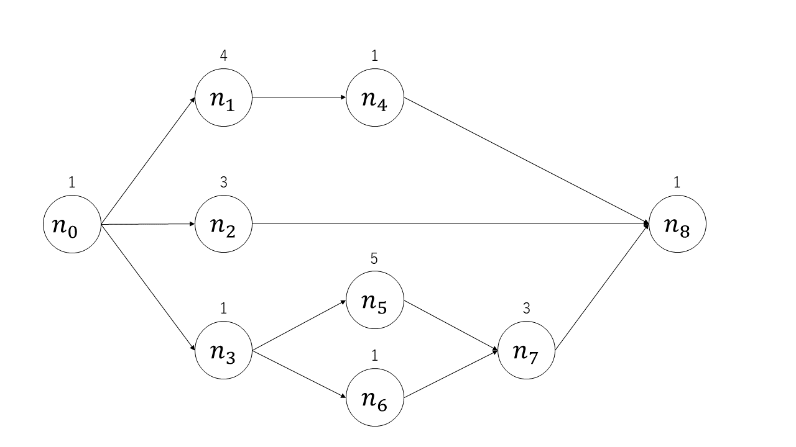

# スケジューリング班OJL_実装課題

## 課題内容
- `ex_prioritization.py`の27行目にノードの実行順序を記述する<br>
- makespan（全てのノードが実行完了するまでに時間）が一定値以下になったら、実行時に`Succeed!`表示がされる<br>
- 課題用DAG1, 2両方で、それぞれ`Succeed!`が出る実行順序を求める<br>
   - 課題用DAG1のクリア基準makespan: 14
   - 課題用DAG2のクリア基準makespan: 13
   - 課題用DAG2はやや難です

課題が終わったら…（発展内容）
- `Succeed!`が出る実行順序の法則性を見つける
   - 法則性に則って自動で実行順序を決定するアルゴリズムを作る（これができたら研究レベル）
- `make_random_dag()`関数を使って適当なDAGを生成、実行順序を調べてみる
   - 法則性が正しいかを調べてみる（法則<適当になるか？）
- コードを読んでみる

## 課題プログラム実行方法
実行準備
```
// git clone またはzipをダウンロード、解凍
$ cd OJL_team_scheduling
$ bash setup.sh
```
また、python環境が必須です。<br>
<br>
実行時
```
$ python3 ex_prioritization.py
```

## 課題プログラム出力
```
order:          [0, 1, 2, 3, 4, 5, 6, 7] # 入力実行順序
makespan:       16 # 全てのノードの実行完了までの時間
result:         Succeed!/Failed...
output:         output/scheduling_result_03251752.html # 実行結果の出力ファイル
```

output/scheduling_result_MMDDYYSS.htmlには、実際にスケジューラがどのようにノードを処理したかが描画されます。<br>
隙間なく埋まっているほど、短いmakespanを示します。

## 課題用DAG
<br>
課題用DAG1
- G = make_template_dag() で呼び出し
- デフォルトの状態（実行順序[0, 1, 2, 3, 4, 5, 6, 7]）で実行するとmakespan: 16<br>
- 目標のmakespan: 14<br>

<br>
課題用DAG2
- G = make_template_dag2() で呼び出し
- デフォルトの状態（実行順序[0, 1, 2, 3, 4, 5, 6, 7, 8]）で実行するとmakespan: 14<br>
- 目標のmakespan: 13<br>

## ディレクトリ構成
.<br>
├── README.md&emsp;#このファイルです<br>
├── ex_prioritization.py&emsp;# 実行ファイルです<br>
├── fig&emsp;# README内の画像が格納されています<br>
├── output&emsp;# 結果ファイルの出力先です<br>
├── requirements.txt<br>
├── setup.bash&emsp;# 環境設定のbashファイルです<br>
└── src&emsp;# ソースコードです（興味があったら読んでみてください）<br>
&nbsp;&nbsp;&nbsp;├── lib&emsp;# sched_sim.pyの依存ファイルです<br>
&nbsp;&nbsp;&nbsp;├── make_dag.py&emsp;# サンプルのDAGを生成するコードです<br>
&nbsp;&nbsp;&nbsp;├── sched_sim.py&emsp;# スケジューリングの実行を行うコードです<br>
&nbsp;&nbsp;&nbsp;└── scheduling_viewer.py&emsp;# スケジューリング結果の可視化を行うコードです<br>

## FAQ
- raise AlgorithmErrorが出る
   - 実行順序が、ノードの順序制約を守っていない可能性が高いです
```
raise AlgorithmError(f'node {node_i} does not allocated.')
src.lib.exceptions.AlgorithmError: node 0 does not allocated.
```
