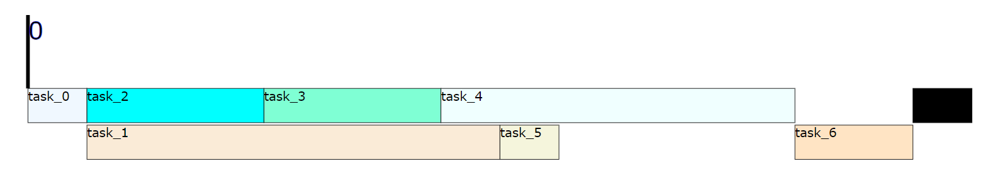
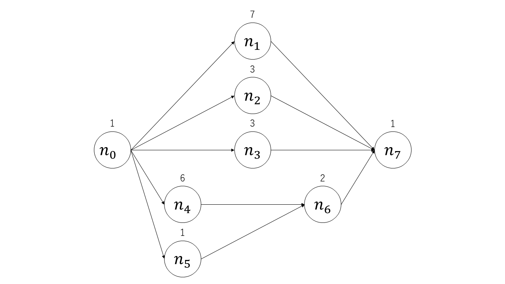

# スケジューリング班OJL_実装課題

## 課題内容
1. 実行時間が長いノードを優先する実行順序を求める処理の実装
2. クリティカルパスを優先した実行順序を求める処理の実装（発展課題）
   1. クリティカルパスは与えられる
   2. クリティカルパス以外は実行時間が長いノードを優先
3. クリティカルパスを検出する処理の実装（超・発展課題）
4. ランダムなDAGでも機能することの確認

## 課題プログラム実行方法
実行準備
```
$ bash setup.sh
```
また、python環境が必須です。<br>
<br>
実行時
```
$ python3 ex_prioritization.py
```

## 課題プログラム出力
```
order:          [0, 1, 2, 3, 4, 5, 6, 7] # 入力実行順序
makespan:       16 # 全てのノードの実行完了までの時間
output:         output/scheduling_result_03251752.html # 実行結果の出力ファイル
```

output/scheduling_result_MMDDYYSS.htmlには、実際にスケジューラがどのようにノードを処理したかが描画されます。<br>
隙間なく埋まっているほど、短いmakespanを示します。

## 課題用DAG
<br>
デフォルトの状態（実行順序[0, 1, 2, 3, 4, 5, 6, 7]）で実行するとmakespan: 16<br>
実行時間が長いノードを優先にするとmakespan: 14<br>
クリティカルパス優先を追加するとmakespan: 13<br>
となります。

## ディレクトリ構成
.<br>
├── README.md&emsp;#このファイルです<br>
├── ex_prioritization.py&emsp;# 実行ファイルです<br>
├── fig&emsp;# README内の画像が格納されています<br>
├── output&emsp;# 結果ファイルの出力先です<br>
├── requirements.txt<br>
├── setup.bash&emsp;# 環境設定のbashファイルです<br>
└── src&emsp;# ソースコードです（興味があったら読んでみてください）<br>
&nbsp;&nbsp;&nbsp;├── lib&emsp;# sched_sim.pyの依存ファイルです<br>
&nbsp;&nbsp;&nbsp;├── make_dag.py&emsp;# サンプルのDAGを生成するコードです<br>
&nbsp;&nbsp;&nbsp;├── sched_sim.py&emsp;# スケジューリングの実行を行うコードです<br>
&nbsp;&nbsp;&nbsp;└── scheduling_viewer.py&emsp;# スケジューリング結果の可視化を行うコードです<br>

## FAQ
- raise AlgorithmErrorが出る
   - 実行順序が、ノードの順序制約を守っていない可能性が高いです
```
raise AlgorithmError(f'node {node_i} does not allocated.')
src.lib.exceptions.AlgorithmError: node 0 does not allocated.
```
